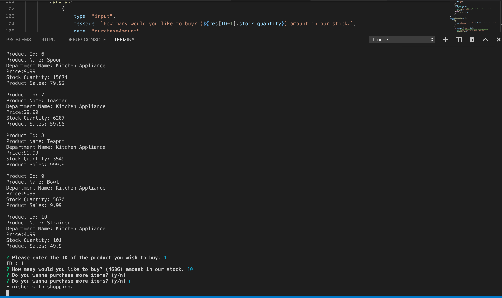

# bamazon
#Description
1. There is a  MySQL Database called `bamazon` in this app.
2. The database contains two tables called `products` and `departments`.
3. The products table has the following columns:

   * item_id (unique id for each product)
   * product_name (Name of product)
   * department_name
   * price (cost to customer)
   * stock_quantity (how much of the product is available in stores)

4. The table `departments` includes the following columns:

   * department_id
   * department_name
   * over_head_costs

# Node app `bamazonCustomer.js`
# Instructions

1. First Node application is called `bamazonCustomer.js`, running this application first displays all of the items available for sale, including the ids, names, and prices of products for sale.

2. The app then prompt users with two messages-

   * The first one asks users the ID of the product they likes to buy.
   * The second message asks how many units of the product they like to buy.

3. Once the customer has placed the order, the application checks if your store has enough of the product to meet the customer's request. If not, the app should log a phrase like `Insufficient quantity!`, and then prevent the order from going through.

# Node app `bamazonManager.js`
# Instructions

1. The node application is called `bamazonManager.js`. Running this application, lists a set of menu options:

    * View Products for Sale  
    * View Low Inventory  
    * Add to Inventory  
    * Add New Product

2. When the manager selects `View Products for Sale`, the app lists every available item: the item IDs, names, prices, and quantities.

3. When the manager selects `View Low Inventory`, then it lists all items with an inventory count lower than five thousand.

4. When the manager selects `Add to Inventory`, your app displays a prompt that will let the manager "add more" of any item currently in the store.

 
5. When the manager selects `Add New Product`, it allows the manager to add a completely new product to the store.

# Node app `bamazonSupervisor.js`
# Instructions

1. The node app is called `bamazonSupervisor.js`. Running this application lists a set of menu options:

   * View Product Sales by Department  
   * Create New Department

2. When a supervisor selects `View Product Sales by Department`, the app should displays a summarized table in their terminal/bash window.

